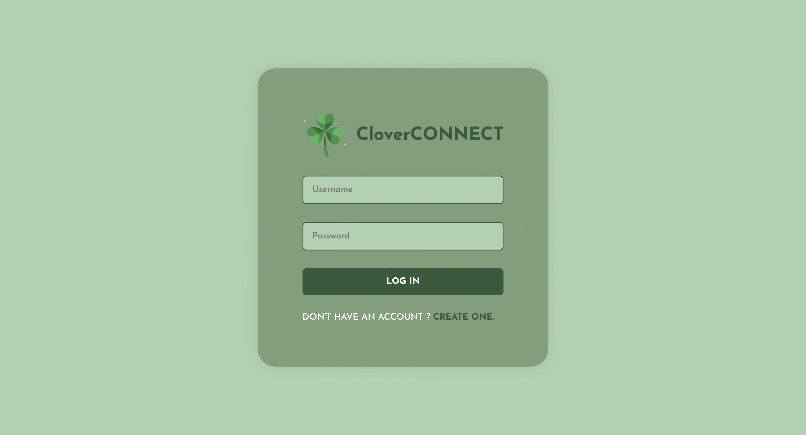
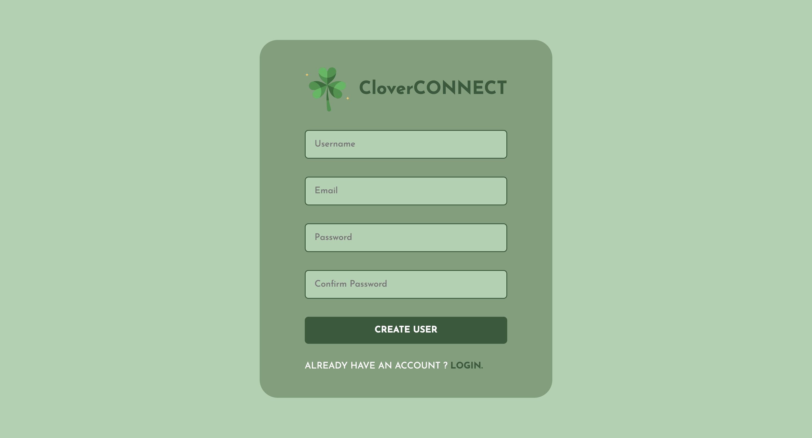

# CloverCONNECT - Chat Application 
CloverCONNECT is a chat application build using MERN Stack.

### Login Page


### Registration Page


## Installation Guide

### Requirements
- [Nodejs]
- [Mongodb]

```shell
git clone https://github.com/anikakayal/CloverCONNECT.git
cd CloverCONNECT
```

Now install the dependencies
```shell
cd server
yarn
cd ..
cd public
yarn
```
We are almost done, Now just start the development server.

For Frontend.
```shell
cd public
yarn start
```
For Backend.

Open another terminal in folder, Also make sure mongodb is running in background.
```shell
cd server
yarn start
```

Done! Now open localhost:3000 in your browser.
